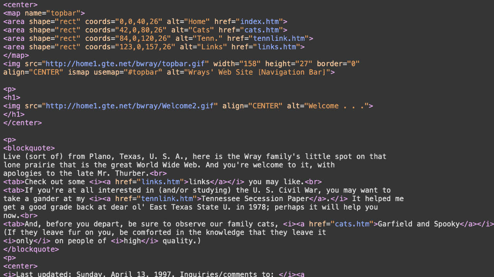

# Welcome.

Yet, as that free-file-space thing gradually went away, so, too, did many personal sites---mine among them.

Over the years, database-driven content management systems ([CMSs](https://en.wikipedia.org/wiki/Web_content_management_system)) like [WordPress](https://wordpress.org) appeared. They provide click-and-drag ease in building a personal site, but they tend to be [security nightmares unless properly maintained](https://ithemes.com/2017/01/16/wordpress-security-issues/), which many aren't. They also introduce a great deal of technical overhead.

And then there are creatures like Facebook, Instagram, and Twitter, which [for all too many people](https://ia.net/topics/take-the-power-back) have become the only Web-based locations for ordinary folks' thoughts. Of course, [all these platforms want](https://adammclane.com/2013/03/in-social-media-you-are-the-product/) is to grab your information, show you ads, and---particularly in the case of Facebook---contribute to the [dumbing-down of your culture](https://www.salon.com/2017/07/16/how-social-media-is-dumbing-down-our-communication/) and the [political polarization of your society](https://www.sciencedirect.com/science/article/pii/S0736585317305208). What's the harm??!?

(Don’t worry. This site is, and will remain, apolitical by design unless we're nearing World War III or something along those lines. Maybe even then, since I doubt my little ol' site is going to stop The Really Big One.)

Anyway, it seemed a lot of the fun had gone out of puttering around on the Web and actually creating content. Then---first among the techno-cognoscenti and, more recently, among us ordinary folks---came Web sites powered by [static site generators (SSGs)](https://www.staticgen.com) and written in [Markdown](https://daringfireball.net/projects/markdown/). I found them a source of curiosity at first but gradually became more interested in the prospect, especially as I learned more about their [technical advantages](https://www.makeuseof.com/tag/reasons-ditch-cms-static-site-generator/); and, so, here we are.

Thank you for stopping by. I hope you find this site a source of various little nuggets of helpful info, and occasionally a laugh or two---even if I hadn't intended it, but especially if I had.

Again, welcome.